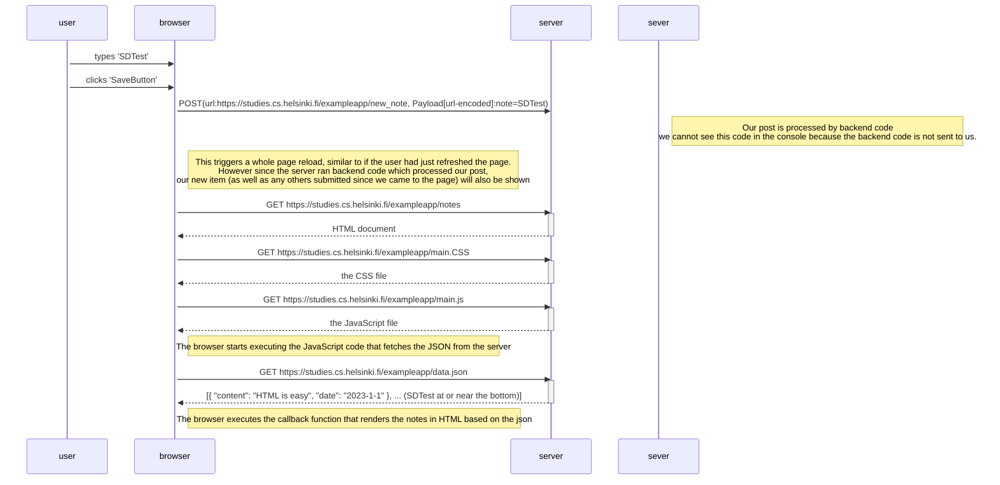

```mermaid
sequenceDiagram
    participant user
    participant browser
    participant server

    activate user
    user->>browser: types 'SDTest'
    user->>browser: clicks 'SaveButton'
    activate browser
    browser->>server: POST(url:https://studies.cs.helsinki.fi/exampleapp/new_note, Payload[url-encoded]:note=SDTest)
    Note right of sever: Our post is processed by backend code<br/> we cannot see this code in the console because the backend code is not sent to us.
    Note right of browser: This triggers a whole page reload, similar to if the user had just refreshed the page.<br/>However since the server ran backend code which processed our post,<br/> our new item (as well as any others submitted since we came to the page) will also be shown

    browser->>server: GET https://studies.cs.helsinki.fi/exampleapp/notes
    activate server
    server-->>browser: HTML document
    deactivate server

    browser->>server: GET https://studies.cs.helsinki.fi/exampleapp/main.CSS
    activate server
    server-->>browser: the CSS file
    deactivate server

    browser->>server: GET https://studies.cs.helsinki.fi/exampleapp/main.js
    activate server
    server-->>browser: the JavaScript file
    deactivate server

    Note right of browser: The browser starts executing the JavaScript code that fetches the JSON from the server

    browser->>server: GET https://studies.cs.helsinki.fi/exampleapp/data.json
    activate server
    server-->>browser: [{ "content": "HTML is easy", "date": "2023-1-1" }, ... (SDTest at or near the bottom)]
    deactivate server

    Note right of browser: The browser executes the callback function that renders the notes in HTML based on the json

```
